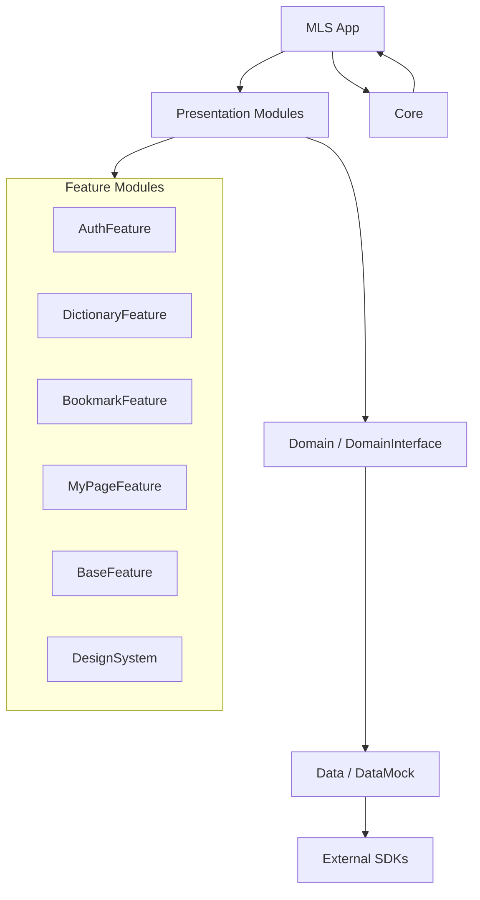

# 메이플랜드사전


<p align="center">
  <a href="https://apps.apple.com/us/app/%EB%A9%94%EC%9D%B4%ED%94%8C%EB%9E%9C%EB%93%9C%EC%82%AC%EC%A0%84/id6477212894">
    
  </a>
</p>

## 프로젝트 소개

**메이플랜드 유저를 위한 깔끔한 정보 아카이브**

메이플랜드를 플레이하다 보면 아이템, 몬스터, 퀘스트 정보를 매번 커뮤니티에서 찾아야 해서 번거롭지 않나요?

메이플랜드사전은 메이플랜드 플레이에 필요한 정보를 **한눈에, 빠르게** 확인할 수 있도록 정리한 사전 앱입니다.

## 주요 기능

### 아이템 사전
아이템 기본 정보 정리, 획득처, 활용 용도 등을 보기 쉽게 제공

### 몬스터 사전
몬스터 정보 및 드랍 아이템 확인, 사냥 준비 전에 빠르게 참고 가능

### 퀘스트 정보
퀘스트 진행 조건과 흐름 정리, 헷갈리기 쉬운 퀘스트를 한 번에 확인

### 즐겨찾기 기능
자주 보는 아이템, 몬스터, 퀘스트 저장, 필요한 정보만 모아서 빠르게 접근

### 이벤트 & 공지 확인
메이플랜드 이벤트 및 주요 소식 정리, 놓치기 쉬운 정보도 간편하게 확인

# MLS-iOS


**MLS-iOS**는 메이플랜드 유저를 위한 사전 iOS 애플리케이션입니다. 몬스터, 아이템, NPC, 퀘스트, 맵 정보를 빠르게 탐색하고 북마크와 컬렉션으로 저장할 수 있도록 구성되어 있습니다.

프로젝트는 Clean Architecture를 바탕으로 `Core`, `Data`, `Domain`, `Presentation` 계층을 분리하고, Presentation은 기능 단위 모듈로 나누어 독립 개발과 Demo 실행이 가능하도록 설계되어 있습니다.

## Highlights

| 구분 | 내용 |
| --- | --- |
| 사전 탐색 | 전체, 몬스터, 아이템, NPC, 퀘스트, 맵 리스트 및 상세 화면 |
| 검색/필터 | 사전 검색, 결과 화면, 정렬/필터 Bottom Sheet |
| 북마크 | 사전 항목 북마크, 컬렉션 생성/수정/상세 관리 |
| 인증 | 카카오/애플 로그인, 온보딩, 약관 동의, 알림 권한 설정 |
| 마이페이지 | 프로필, 캐릭터 설정, 알림 설정, 공지/이벤트/패치노트/약관 |
| 디자인 시스템 | 공통 버튼, 검색바, 배지, 탭바, 스낵바, 토스트, 리스트 컴포넌트 |

## Tech Stack

| 영역 | 기술 |
| --- | --- |
| Language | Swift 5.0 |
| UI | UIKit, SnapKit |
| Architecture | Clean Architecture, ReactorKit |
| Reactive | RxSwift, RxCocoa, RxGesture, RxKeyboard |
| Network | Alamofire |
| Auth | Kakao SDK, Apple Sign In |
| Push/Analytics | Firebase Messaging |
| Storage | Keychain, UserDefaults, Memory/Disk Image Cache |
| Dependency Management | Swift Package Manager |

## Architecture



각 기능 모듈은 실제 구현체와 Interface 타깃을 함께 둡니다. 앱 모듈은 Interface에 의존하고, `AppDelegate`에서 DIContainer를 통해 Provider, Repository, UseCase, Factory를 등록합니다.

## Project Structure

```text
MLS
├── MLS                         # 앱 엔트리, AppDelegate, SceneDelegate, AppCoordinator
├── Core                        # DIContainer 등 공통 기반
├── Data
│   ├── Data                    # Network, Provider, Repository 구현체
│   └── DataMock                # Demo/테스트용 Mock 구현체
├── Domain
│   ├── Domain                  # UseCase 구현체, Interceptor
│   └── DomainInterface         # Entity, Repository, UseCase Protocol
├── Presentation
│   ├── AuthFeature             # 로그인, 온보딩, 약관, 알림 권한
│   ├── DictionaryFeature       # 사전 메인/검색/리스트/상세/필터
│   ├── BookmarkFeature         # 북마크, 컬렉션, 북마크 모달
│   ├── MyPageFeature           # 마이페이지, 프로필, 고객지원
│   ├── BaseFeature             # BaseViewController, 공통 View/Util
│   └── DesignSystem            # 공통 UI 컴포넌트와 리소스
└── MLSTests                    # 앱 테스트 타깃
```

## Getting Started

### Requirements

- Xcode 16 이상 권장
- iOS 15.6 이상
- Swift Package Manager
- Firebase 설정 파일: `MLS/MLS/Resource/GoogleService-Info.plist`
- Kakao Native App Key 설정: `MLS/KakaoConfig.xcconfig`

### Run

1. 저장소를 클론합니다.

```bash
git clone <repository-url>
cd MLS-iOS
```

2. Workspace를 엽니다.

```bash
open MLS/MLS.xcworkspace
```

3. Xcode에서 `MLS` 스킴을 선택하고 실행합니다.

CLI로 확인하고 싶다면 아래 명령을 사용할 수 있습니다.

```bash
xcodebuild -workspace MLS/MLS.xcworkspace \
  -scheme MLS \
  -destination 'platform=iOS Simulator,name=iPhone 16' \
  build
```

### Demo Schemes

기능 단위 화면을 빠르게 확인할 수 있는 Demo 스킴이 포함되어 있습니다.

| Scheme | 용도 |
| --- | --- |
| `MLS` | 실제 앱 실행 |
| `MLSTests` | 앱 테스트 |
| `DesignSystemDemo` | 디자인 시스템 컴포넌트 확인 |
| `AuthFeatureDemo` | 인증/온보딩 기능 단독 확인 |
| `DictionaryFeatureDemo` | 사전 기능 단독 확인 |
| `BookmarkFeatureDemo` | 북마크 기능 단독 확인 |
| `MyPageFeatureDemo` | 마이페이지 기능 단독 확인 |

## Module Guide

### Core

- `DIContainer`를 통해 타입과 이름 기반 의존성 등록/해결을 담당합니다.
- 앱 시작 시 `AppDelegate.registerDependencies()`에서 Provider, Repository, UseCase, Factory가 등록됩니다.

### Data

- `NetworkProviderImpl`에서 네트워크 요청을 처리합니다.
- Repository 구현체가 DTO를 Domain Entity로 변환합니다.
- `KeyChainRepositoryImpl`, `UserDefaultsRepositoryImpl`로 로컬 토큰과 설정 값을 관리합니다.

### Domain

- 화면과 데이터 계층 사이의 UseCase를 제공합니다.
- `DomainInterface`에 Entity, Repository Protocol, UseCase Protocol을 두어 계층 간 결합도를 낮춥니다.
- `TokenInterceptor`로 인증 토큰이 필요한 API 요청을 처리합니다.

### Presentation

- ReactorKit 기반으로 `Action -> Mutation -> State` 흐름을 구성합니다.
- ViewController는 사용자 이벤트 바인딩과 화면 전환을 담당하고, View는 UIKit/SnapKit으로 레이아웃을 구성합니다.
- 각 Feature는 `Feature`, `FeatureInterface`, `FeatureDemo` 형태로 나뉘어 있습니다.

## Key Dependencies

| Package | Version |
| --- | --- |
| RxSwift | 6.9.0 |
| ReactorKit | 3.2.0 |
| SnapKit | 5.7.1 |
| Alamofire | 5.10.2 |
| RxKeyboard | 2.0.1 |
| RxGesture | 4.0.4 |
| Firebase iOS SDK | 11.15.0 |
| Kakao iOS SDK | master `787763e` |

전체 패키지 잠금 정보는 `MLS/MLS.xcworkspace/xcshareddata/swiftpm/Package.resolved`에서 확인할 수 있습니다.

## Convention

### Branch

```text
태그/#이슈번호-작업-이름

ex) feat/#32-home-some-work
```

### Commit

```text
태그/#이슈번호: 커밋 내용

ex) feat/#12: ViewController 이동 동작 구현
```

### Tag

| Tag | Description |
| --- | --- |
| `feat` | 새로운 기능 추가 |
| `fix` | 버그 수정, 잔수정, 병합 충돌 해결 |
| `style` | 코드 스타일 수정, 컨벤션 적용 |
| `refactor` | 프로덕션 코드 리팩토링, 파일 삭제, 네이밍 수정 및 폴더링 |
| `docs` | 문서 수정, 필요한 주석 추가 및 변경 |
| `add` | 파일 추가 |
| `test` | 테스트 코드 추가 |
| `chore` | 빌드 설정, 프로젝트 설정 등 로직에 영향 없는 변경 |
| `remove` | 파일 삭제 |

## Useful Commands

```bash
# Workspace 스킴 확인
xcodebuild -list -workspace MLS/MLS.xcworkspace

# 앱 빌드
xcodebuild -workspace MLS/MLS.xcworkspace \
  -scheme MLS \
  -destination 'platform=iOS Simulator,name=iPhone 16' \
  build

# 테스트 실행
xcodebuild -workspace MLS/MLS.xcworkspace \
  -scheme MLSTests \
  -destination 'platform=iOS Simulator,name=iPhone 16' \
  test
```

## Notes

- 실제 앱 실행은 `MLS/MLS.xcworkspace` 기준으로 진행하는 것을 권장합니다.
- `GoogleService-Info.plist`와 `KakaoConfig.xcconfig`는 앱 실행에 필요한 외부 서비스 설정입니다.
- Demo 타깃은 기능 모듈을 독립적으로 확인하기 위한 용도이며, 일부 Demo 타깃은 별도 Mock/DI 등록 흐름을 사용합니다.


## 면책 조항

본 앱은 메이플랜드의 공식 앱이 아니며, Nexon 및 관련 회사와 제휴 또는 연관되어 있지 않은 비공식 팬메이드 정보 앱입니다.
게임 내 명칭 및 콘텐츠의 저작권은 각 권리자에게 있습니다.
